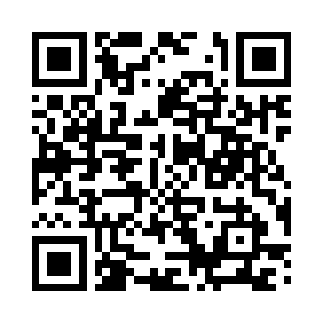

  

# Introduction to the Art of Mixing — Teaching Demo

A 45-minute undergraduate lecture introducing audio mixing.

This introductory class on mixing is designed to be DAW-agnostic but will use Logic Pro for demonstrations.

## Materials

- [Lecture Handout](lecture/lecture-handout.md)
- [Mixing Assignment](lecture/mixing-assignment.md)
