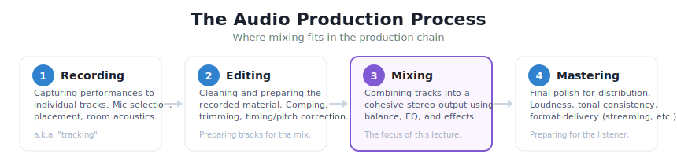
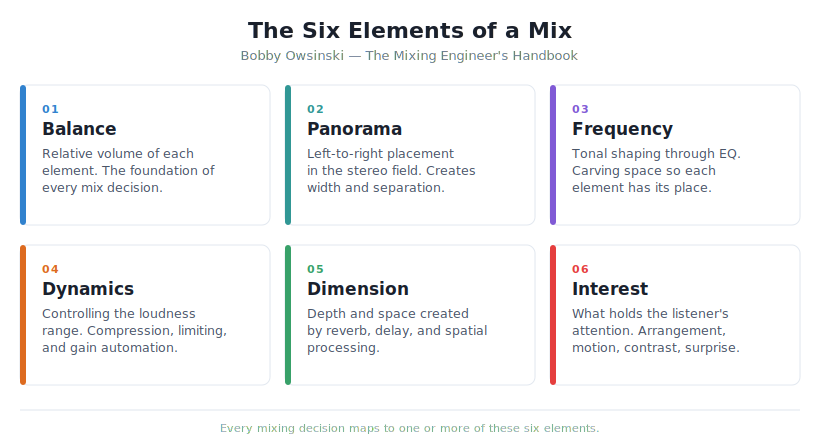
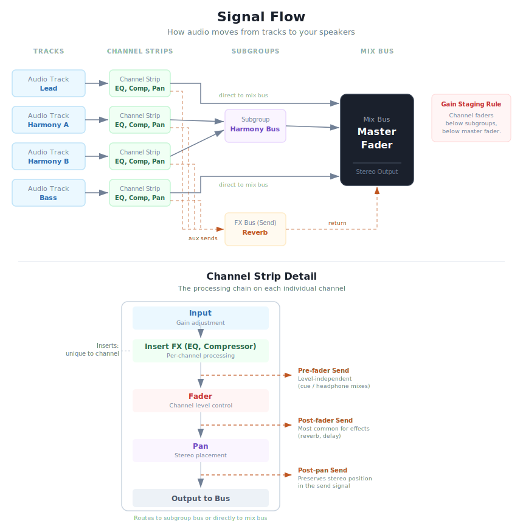
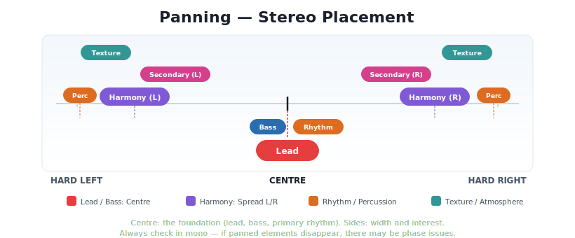
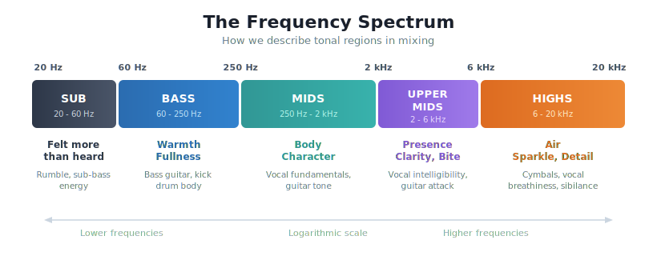
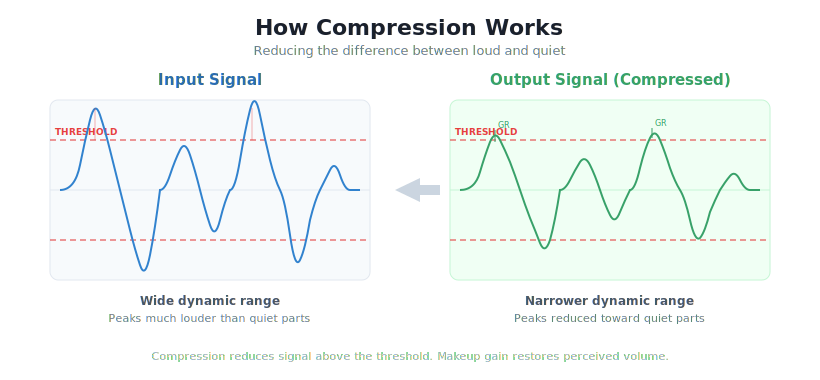
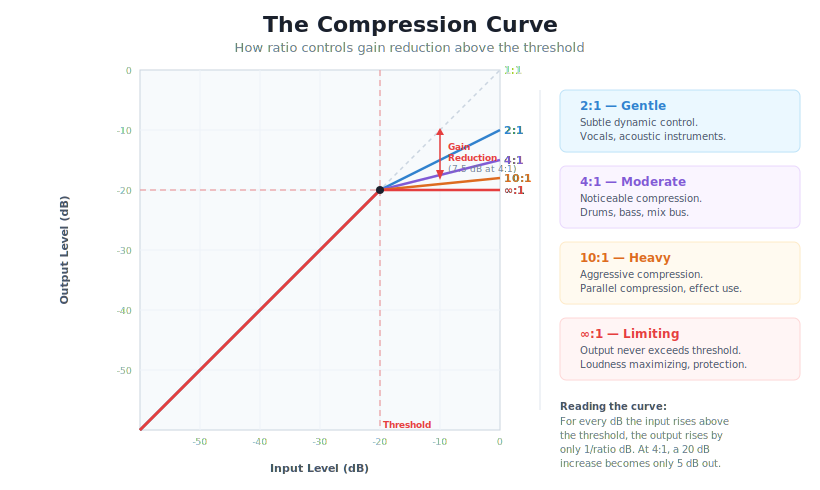
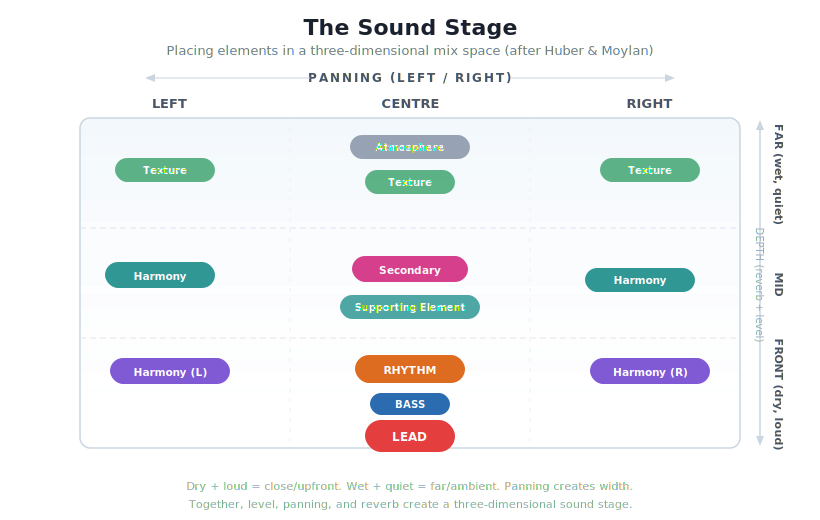

# Intro to Audio Mixing

  

---

Logic Session we will work though today is available here for download:

https://drive.google.com/file/d/1voTiR91ezcdVg04ZDi5TENgO9HwLmuxr/view?usp=sharing

Click on the three-dots and then "download"

## What is Mixing?

"We are mixing engineers, but more importantly: we are *sonic artists*."
— Roey Izhaki, *Mixing Audio*

Mixing is the process of combining individual recorded tracks into a finished single piece of audio. It is both a technical craft and a creative act.

---

## Owsinski's Six Elements of a Mix

Bobby Owsinski's framework from *The Mixing Engineer's Handbook* organizes everything in a mix into six elements:

---

## Mixing Workflow

---

## 1. Organize

Name, colour-code, and group your tracks. Route related channels to subgroup busses (e.g., all drums to a "Drums" bus). create a mix bus and global reverb bus. Set yourself up for clarity or signal flow and organization before you touch any processing.

**Key concept**: Use **inserts** for processing that's unique to a channel (EQ, compression). Use **sends** for effects shared across multiple channels and additive effects (reverb, delay). This creates a cohesive sense of space, finer control of the sound, and saves CPU.

---

## 2. Gain Stage

Gain staging means setting healthy and balanced signal levels across all tracks. The goal is to keep levels in the "sweet spot": loud enough for a clean signal, quiet enough to avoid clipping and leave headroom. 

Gain staging can be achieved with a gain plugin at the top of the processing chain or other means depending on the DAW. Leave your faders at unity, those will be used later on!

### Best Practices

- **Start at the source**: Set your channel input gain so peaks sit around -18 to -12 dBFS — this leaves plenty of headroom and keeps plugins operating in their sweet spot
- **Unity gain through plugins**: After adding EQ or compression (stage 4 and 5), check that the output level roughly matches the input level. Louder isn't better — it just tricks your ears and makes the comparison harder.
- **Watch the mix bus**: Keep your master fader at 0 dB. If the mix bus is clipping, turn individual channels *down* rather than pulling the master fader down.
- **Leave Headroom*: On your mix bus aim for peaks below -6 dBFS — this leaves room for mastering.

---

## 3. Static Mix & Panning

Use the faders and pan only — no plugins. Get the balance right first. This is the foundation of your mix.

Some typical panning:
- **Centre**: Lead, bass, and primary rhythm.
- **Sides**: Harmony, secondary elements, texture, percussion. consider hard panning and using the entire width available!
- **Check in mono**: If panned elements disappear in mono, there may be phase issues.

---

## 4. EQ (Equalization)

EQ shapes the **frequency content** of a sound — what you hear as tone, brightness, warmth, or muddiness.

### The Frequency Spectrum

### EQ Controls

| Parameter | What It Does | Think of It As... |
|-----------|-------------|-------------------|
| **Frequency** | Selects the centre frequency to boost or cut | Where on the spectrum you're working |
| **Gain** | How much you boost (+) or cut (−), in dB | How much you're turning that frequency range up or down |
| **Q (Bandwidth)** | How wide or narrow the affected range is | Low Q = broad and gentle; High Q = narrow and surgical |

### Common Filter Types

| Filter | Shape | Typical Use |
|--------|-------|-------------|
| **Bell (Peak)** | Symmetrical boost/cut around a centre frequency | General-purpose tonal shaping — the most common EQ filter |
| **High-Pass (HPF / Low Cut)** | Passes highs, removes everything below a cutoff | Cleaning low-end rumble from non-bass instruments |
| **Low-Pass (LPF / High Cut)** | Passes lows, removes everything above a cutoff | Taming harsh high-frequency content or creating a "distant" effect |
| **High Shelf** | Boosts or cuts all frequencies above a set point | Adding "air" or reducing brightness across the top end |
| **Low Shelf** | Boosts or cuts all frequencies below a set point | Adding warmth or reducing low-end weight |
| **Notch (Band-Reject)** | Very narrow cut at a specific frequency | Removing a specific resonance or hum (e.g., 60 Hz electrical hum) |

A **parametric EQ** gives you independent control of frequency, gain, and Q for each band — it is the standard EQ type in most DAWs and the most flexible tool for mixing.

### Owsinski's Six Trouble Frequency Areas

| Frequency | Problem | Solution |
|-----------|---------|----------|
| ~200 Hz | Mud, boominess | HPF or gentle cut |
| 300-500 Hz | Boxiness | Narrow cut |
| ~800 Hz | Cheap, hollow | Narrow cut |
| 1-1.5 kHz | Nasal, honky | Narrow cut |
| 4-6 kHz | Harsh, sibilant | Gentle cut or de-esser |
| 10 kHz+ | Hiss, sibilance | Shelf cut or de-esser |

### Best Practices of EQ

- **Subtractive first**: Cut problem frequencies before boosting desired ones — introduces fewer artifacts (Senior, *Mixing Secrets*)
- **HPF on nearly everything**: Unless it's bass or kick, high-pass filter to remove unnecessary low-end rumble.
- **Cut narrow, boost wide**: Surgical cuts target problems and broad boosts sound more natural
- **Don't use it if it doesn't need it!

---

## 5. Compression

Compression controls **dynamic range** — the difference between the loudest and quietest parts of a signal.

### How It Works

### The Compression Curve

### Key Parameters

| Parameter | What It Does | Think of It As... |
|-----------|-------------|-------------------|
| **Threshold** | Level where compression begins | The "trigger point" |
| **Ratio** | How much to reduce above threshold | How aggressively the dynamic range is compressed |
| **Attack** | How quickly compression engages | Fast = catches transients; Slow = lets transients through |
| **Release** | How quickly compression stops | Fast = can produce a pumping effect; Slow = smooth |
| **Makeup Gain** | Boosts output to compensate for reduction | Restoring perceived volume |

You can think of a compressor kind of like an automated fader that brings down the level past a certain loudness.

### Best Practices

- **Start gentle**: Low ratio (2:1-4:1), moderate threshold, and adjust from there
- **Listen, don't just look at meters**: Use your ears, not the gain reduction display
- **Compression is a balance tool**: "From a mix perspective, the primary purpose of compression is to achieve a stable balance." — Mike Senior, *Mixing Secrets*
- **The fader instability diagnostic**: If you keep adjusting a fader, that track probably needs compression (Senior)

---

## 6. Reverb / FX

Reverb can create a global sense of **space** but can also be used as an effect on a single track or subgroup.

Today we will focus on the idea of a global reverb that helps to create a sense of shared space and coherence to a mix.

### The Sound Stage (after Huber & Moylan)

### Key Parameters

| Parameter | What It Does | Tip |
|-----------|-------------|-----|
| **Pre-delay** | Gap before reverb begins | Longer = keeps lead element clear and upfront |
| **Decay time** | Length of reverb tail | Consider matching to song tempo — reverb can be rhythmic |
| **Wet/dry** | Blend of effect vs. original | Less is usually more |
| **Type** | Hall, room, plate, spring, etc. | Each has a character; experiment and get to know the sound of these different types|

### Best Practices

- **Use sends, not inserts for additive effects like reverb**: Route multiple channels to a shared reverb bus with 100% wet and 0% dry signal to control how much reverb is added to the mix and cohere various parts together into the same virtual space

---

## 7. Refine

Revisit your balance. Make small tweaks to fader levels, EQ, and compression now that all the processing is in place. This might also be a nice place to have a little break and step away from the mix before returning with fresh ears.

---

## 8. Check

- **Reference tracks**: Compare your mix against professional mixes in a similar genre.
- **Mono check**: Collapse to mono to check for phase issues.
- **Low volume**: Does the balance hold at a whisper?
- **Different systems**: Headphones, laptop speakers, car — your mix should translate.

---

## 9. Automate

Volume rides, effect sends, panning movement, filter sweeps — automation is the final stage and a great place to get creative.

---

## Free Resources

| Resource | What It Is | URL |
|----------|-----------|-----|
| **cambridge-mt.com** | 500+ free multitrack sessions for mixing practice | cambridge-mt.com/ms/mtk/ |
| **iZotope Learn Hub** | Free articles and guides on mixing fundamentals | izotope.com/en/learn |
| **Produce Like A Pro (YouTube)** | Full mixing tutorials with free multitracks | YouTube |

## Recommended Reading

- **Bobby Owsinski** — *The Mixing Engineer's Handbook* (5th ed., 2022) — Accessible framework + engineer interviews
- **Mike Senior** — *Mixing Secrets for the Small Studio* (2nd ed., 2019) — Practical, budget-friendly, hands-on
- **Roey Izhaki** — *Mixing Audio* (4th ed., 2024) — Comprehensive technical reference
- **William Moylan** — *The Art of Recording* (2002/2015) — Deep analytical and aesthetic perspective
- **David Miles Huber** — *Modern Recording Techniques* (9th ed., 2017) — Broad survey of the full recording chain
